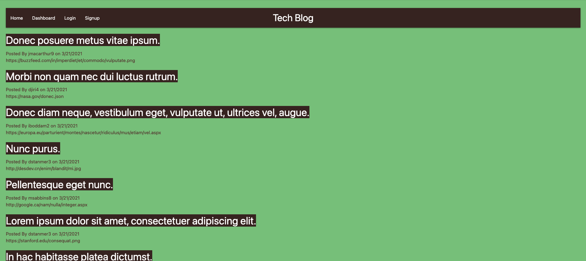
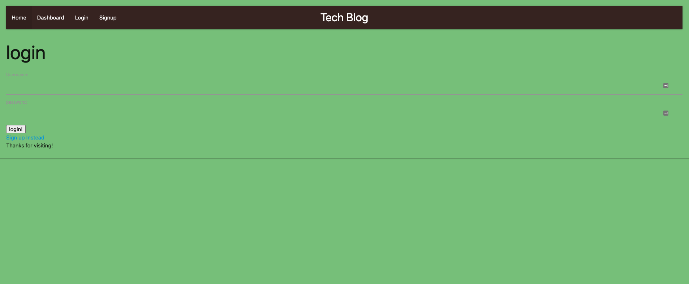
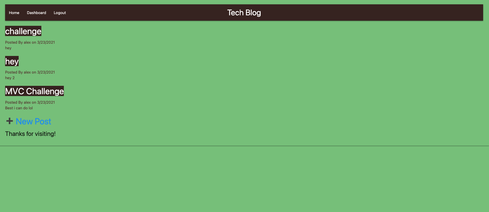

  ### Tech Blog 
  
  ## Description
  A CMS-style blog site similar to a Wordpress site, where developers can publish their blog posts and comment on other developers’ posts as well.

  ##  Table of Contents
  * [Installation](#installation)
  * [Usage](#usage)
  * [License](#License)
  * [Contributing](#contributing)
  * [Tests](#Tests)
  * [Questions](#questions)
  
  ## Usage
  In order to run this application, you must fork to your local machine and run it using npm start, download express-handlebars, MySQL2, Sequelize, and Express packages.
  
  
  # License
  This project is  licensed MIT license.
  
  ## Contributing
  Contributors: Alex Reveles
  ## Test
  The following is needed to run the test: npm start.
  ## Questions
  If you have any questions regarding about the application, please contact me https://github.com/alexreveles or alexreveles@yahoo.com

### heroku
### https://github.com/alexreveles/tech-blog
### https://github.com/alexreveles

